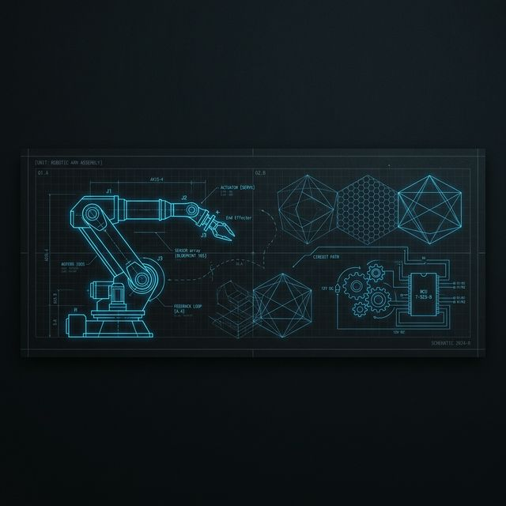

# 👋 Hi, I'm Aryan Yadav  
### Mechatronics & Robotics Engineer | ROS2 | Autonomous Systems  

  

  
  
  

---

### 🚀 About Me
I am a Mechatronics Engineer specializing in **Robotics and Autonomous Systems**. My expertise lies in building end-to-end robotics pipelines, from perception and planning to control and deployment. I am passionate about creating robust, intelligent systems that solve real-world challenges in mechatronics and automation.

- 🔭 I’m currently working on **Autonomous Navigation & Reinforcement Learning**.
- 🌱 I’m learning **Deep Reinforcement Learning for Motion Planning**.
- 👯 I’m looking to collaborate on **Open Source ROS2 projects** and **Surgical Robotics**.
- 💬 Ask me about **ROS2, Control Theory, or Computer Vision**.

---

### 🛠 Tech Stack

| Category | Skills |
| :--- | :--- |
| **Robotics & Autonomy** |     |
| **Perception** |    |
| **Control & Estimation** |    |
| **Programming** |    |
| **Simulation & Systems** |    |

---

### 🌟 Featured Projects

#### 🏎️ [Autonomous Vehicle using ROS2 & RL](https://github.com/Docprox-pixel/Autonomous-Vehicle-using-ROS2-and-Reinforcement-Learning)
> Integrated perception, planning, and control for reliable autonomous navigation. Optimized PID controllers and applied Reinforcement Learning for data-driven steering.
- **Tech**: ROS2, OpenCV, RL, Python, Gazebo.

#### 🦾 [Gesture-Controlled Surgical Robot](https://github.com/Docprox-pixel/laproscopic_grasper)
> Established ROS2-based teleoperation with <100ms latency. Implemented haptic feedback and URDF modeling for precision manipulation.
- **Tech**: ROS2, Haptic Feedback, URDF, C++.

#### 🏗️ [2-DOF Robot Manipulator Control](https://github.com/Docprox-pixel/2DOF-Robot-Manipulator-Control-Simulation)
> Modeled dynamics in MATLAB/Simulink and validated PID/Computed Torque Control for precision positioning.
- **Tech**: MATLAB, Simulink, Control Theory.

---

### 📊 GitHub Stats

  
  

---

### 🎓 Education & Certifications
- **M.Tech in Mechatronics Engineering** | Amrita Vishwa Vidyapeetham (2025 – 2027)
- **B.Tech in Mechanical Engineering** | Ludhiana College of Engineering (2021 – 2025)
- 📜 SolidWorks, ANSYS, MATLAB, & Python Certifications.

---

  <i>"Designing robust, efficient, and safety-critical solutions for real-world robotics."</i>

